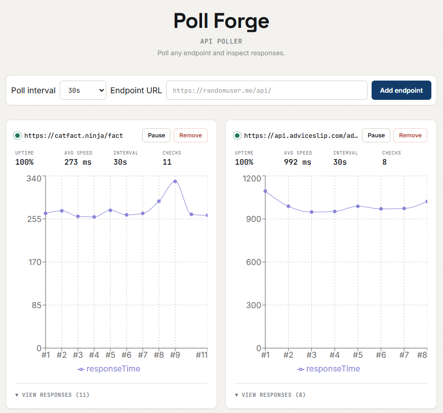

# Poll Forge

A full-stack API polling tool built with React, TypeScript, and Express. Add any endpoint and Poll Forge checks it on a schedule, tracking uptime, response time, and full response history over time.

**Status:** ✅ Live
**Live demo:** https://poll-forge-client-production.up.railway.app



## Features

- Poll any HTTP/HTTPS endpoint on a configurable interval (30s, 1m, 2m, 5m)
- Live uptime %, average response time, and check count per endpoint
- Response time history chart per endpoint
- Full response inspector — status code, headers, and body for every check
- Pause/resume/remove individual endpoints
- Polling resumes automatically after a page refresh
- Endpoint list persists locally between sessions

## Security & reliability

Since this tool fetches arbitrary user-submitted URLs server-side, it includes:

- **SSRF protection** — blocks requests to private/internal IP ranges and cloud metadata endpoints, resolved via DNS before any request is made
- **Request timeout** — outbound requests are capped at 10 seconds
- **Rate limiting** — 30 requests per minute per IP on the polling endpoint
- **Locked-down CORS** — only the deployed frontend origin can call the API

## Tech stack

**Frontend:** React, TypeScript, Vite, Recharts
**Backend:** Node.js, Express, TypeScript (run via `tsx`)
**Infrastructure:** Docker, deployed on Railway

## Project structure

```
Poll-Forge/
├── client/          # React frontend
│   ├── src/
│   │   ├── services/
│   │   │   └── polling.ts
│   │   └── ...
│   ├── Dockerfile
│   └── nginx.conf
├── server/          # Express backend
│   ├── server.ts
│   └── Dockerfile
├── docker-compose.yml
└── screenshots/
```

## Running locally

### With Docker (recommended)

Requires [Docker Desktop](https://www.docker.com/products/docker-desktop/).

```bash
docker compose up --build
```

Visit `http://localhost:5173`.

### Without Docker

Requires Node.js 20+.

**Backend:**
```bash
cd server
npm install
npm run dev
```

**Frontend** (in a separate terminal):
```bash
cd client
npm install
npm run dev
```

## Environment variables

**`client/.env.development`** and **`client/.env.production`**
```
VITE_API_URL=http://localhost:5001   # or your deployed backend URL
```

**Backend** (set in your deployment host's dashboard, not committed to the repo)
```
FRONTEND_URL=http://localhost:5173   # or your deployed frontend URL
PORT=5001
```

## Known limitations

- Endpoint data is stored in the browser's `localStorage`, so it's per-browser/per-device, not synced across sessions or devices
- Free-tier hosting may briefly sleep after periods of inactivity

## License

MIT — see [LICENSE](./LICENSE)